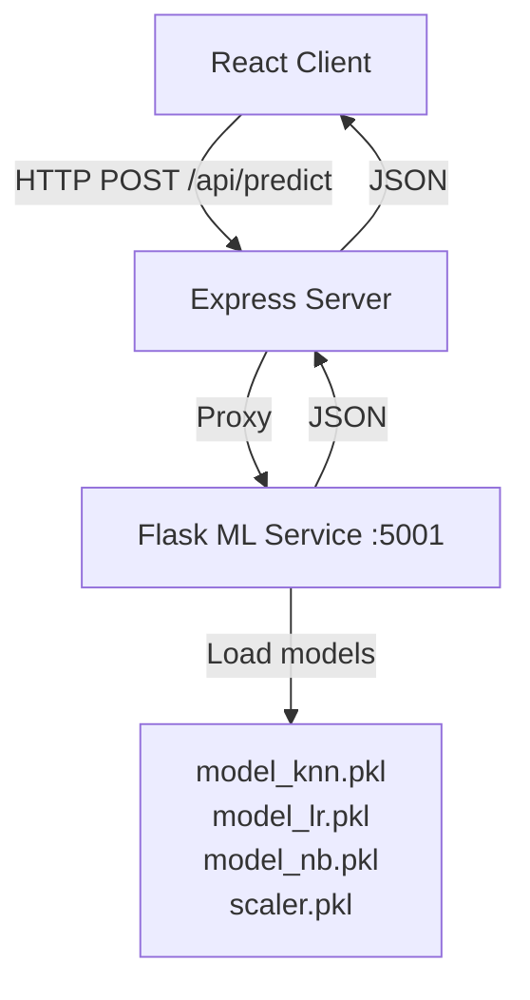

# Student Performance Predictor - Implementation Plan

## 1. Analysis Summary

### Input Features (19 features from dataset)
| Feature | Type | Options |
|---------|------|---------|
| Hours_Studied | Numeric | 0-50 |
| Attendance | Numeric | 0-100% |
| Parental_Involvement | Categorical | Low, Medium, High |
| Access_to_Resources | Categorical | Low, Medium, High |
| Extracurricular_Activities | Categorical | Yes, No |
| Sleep_Hours | Numeric | 0-24 |
| Previous_Scores | Numeric | 0-100 |
| Motivation_Level | Categorical | Low, Medium, High |
| Internet_Access | Categorical | Yes, No |
| Tutoring_Sessions | Numeric | 0-10 |
| Family_Income | Categorical | Low, Medium, High |
| Teacher_Quality | Categorical | Low, Medium, High |
| School_Type | Categorical | Public, Private |
| Peer_Influence | Categorical | Positive, Negative, Neutral |
| Physical_Activity | Numeric | 0-14 hours |
| Learning_Disabilities | Categorical | Yes, No |
| Parental_Education_Level | Categorical | High School, College, Postgraduate |
| Distance_from_Home | Categorical | Near, Moderate, Far |
| Gender | Categorical | Male, Female |

### Predicted Output
- **Exam_Score** (Numeric, 0-100)

### Architecture Recommendation: Option A (Flask Backend)

**Why Option A is best:**
- Leverages existing trained sklearn models directly (no reconversion needed)
- Your ml-service already has requirements.txt with flask, scikit-learn, pandas, numpy
- Simpler implementation and maintenance
- More secure - model logic stays on server
- Models can be updated without client changes

## 2. System Architecture



## 3. Folder Structure Changes

```
c:/projects/web projects/ibraheem/
├── ml-service/
│   ├── app.py                    [NEW - Flask prediction service]
│   ├── model_knn.pkl             [EXISTING]
│   ├── model_lr.pkl              [EXISTING]
│   ├── model_nb.pkl              [EXISTING]
│   ├── model_columns.pkl         [EXISTING]
│   ├── scaler.pkl                [EXISTING]
│   ├── StudentPerformanceFactors.csv [EXISTING]
│   └── requirements.txt          [EXISTING - may need updates]
├── server/
│   ├── routes/
│   │   └── studentPerformance.js [NEW - API route to proxy to Flask]
│   └── index.js                  [MODIFY - add new route]
└── client/
    └── src/
        ├── App.js                [MODIFY - add new route]
        └── pages/
            ├── StudentPerformancePredictor.js  [NEW]
            └── StudentPerformancePredictor.css  [NEW]
```

## 4. Implementation Steps

### Step 1: Create Flask ML Service
- Create `ml-service/app.py`
- Implement `/predict` endpoint that:
  - Accepts JSON with 19 features
  - Loads models and scaler
  - Applies preprocessing (encode categorical, scale numeric)
  - Returns predictions from all 3 models (KNN, LR, NB)
  - Returns average prediction

### Step 2: Create Server Route
- Create `server/routes/studentPerformance.js`
- Implement proxy endpoint `/api/predict-student-performance`
- Forward request to Flask service at localhost:5001
- Return prediction to client

### Step 3: Update Express Server
- Add to `server/index.js`:
  ```javascript
  app.use('/api/student-performance', require('./routes/studentPerformance'));
  ```

### Step 4: Add React Route
- Add route in `client/src/App.js`:
  ```jsx
  <Route path="/techspace/StudentPerformancePredictor" element={<StudentPerformancePredictor />} />
  ```

### Step 5: Create React Page
- Create `client/src/pages/StudentPerformancePredictor.js`
- Form with 19 input fields (mix of number inputs and selects)
- Submit button to call API
- Display prediction results

### Step 6: Create CSS Styling
- Create `client/src/pages/StudentPerformancePredictor.css`
- Match existing page styling

### Step 7: Update TechSpace Link
- Add navigation link to StudentPerformancePredictor in TechSpace.js

## 5. API Contracts

### Client → Express Server
```http
POST /api/predict-student-performance
Content-Type: application/json

{
  "Hours_Studied": 20,
  "Attendance": 85,
  "Parental_Involvement": "Medium",
  "Access_to_Resources": "High",
  "Extracurricular_Activities": "No",
  "Sleep_Hours": 7,
  "Previous_Scores": 75,
  "Motivation_Level": "Medium",
  "Internet_Access": "Yes",
  "Tutoring_Sessions": 2,
  "Family_Income": "Medium",
  "Teacher_Quality": "High",
  "School_Type": "Public",
  "Peer_Influence": "Positive",
  "Physical_Activity": 3,
  "Learning_Disabilities": "No",
  "Parental_Education_Level": "College",
  "Distance_from_Home": "Near",
  "Gender": "Male"
}
```

### Express Server → Client
```json
{
  "success": true,
  "predictions": {
    "knn": 72.5,
    "logistic_regression": 71.8,
    "naive_bayes": 70.2,
    "average": 71.5
  }
}
```

## 6. Running Both Servers Together

### Development (Local):

**Terminal 1 - Express Server:**
```bash
cd c:/projects/web projects/ibraheem
npm start
# Runs on port 5000
```

**Terminal 2 - Flask ML Service:**
```bash
cd c:/projects/web projects/ibraheem/ml-service
pip install -r requirements.txt  # Install Python deps if not done
python app.py
# Runs on port 5001
```

### Production Deployment:

**Digital Ocean App Platform:**
- Your existing Node.js/React app (deploys from GitHub)
- Already configured with `npm run build` and `npm run start`

**Render.com (Free Tier):**
- Create new Web Service from GitHub
- Source directory: `/ml-service`
- Build command: `pip install -r requirements.txt`
- Start command: `python app.py`
- Free tier sleeps after 15 min inactivity (30s wake-up)

### Environment Configuration

- Express: port 5000 (defined in .env)
- Flask: port 5001 (hardcoded in ml-service/app.py)
- CORS enabled on Flask to allow Express proxy

## 7. Implementation Notes

- Flask service runs on port 5001 (different from Express on 5000)
- Need to install Flask dependencies: `pip install flask flask-cors scikit-learn pandas numpy`
- Model ensemble (average of 3 models) provides more robust predictions
- Categorical encoding must match training preprocessing
- Consider adding input validation and error handling
